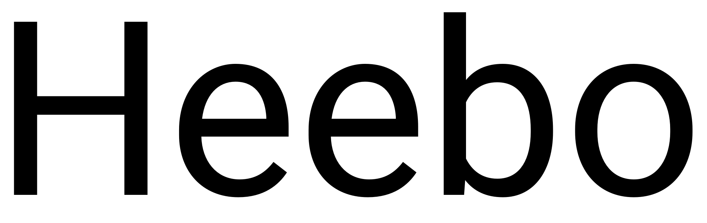
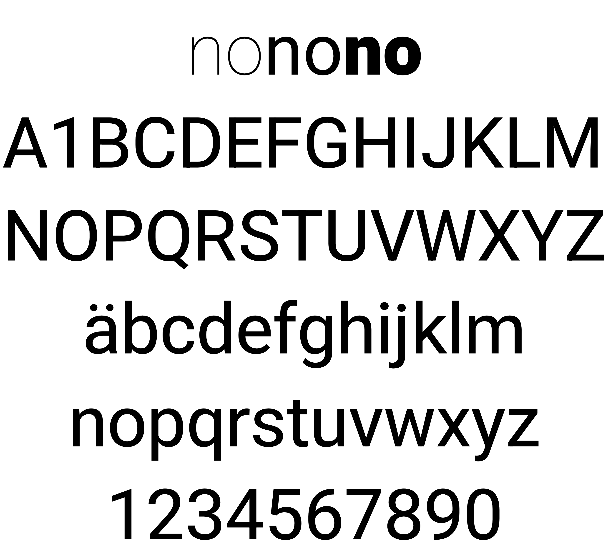

# Heebo

Heebo is a Hebrew and Latin typeface family that includes Christian Roberton's Roboto Latin and extends it into Hebrew.

Since the Hebrew design of this family is primary, the vertical metrics are different to Roboto. 
Also, the family is auto-hinted whereas Roboto is hand-hinted, so the rendering quality of Roboto may be better on older Windows machines.

The Hebrew project was led and designed by [Oded Ezer](https://www.hebrewtypography.com/), a Tel Aviv based graphic and type designer, design educator and a typographic experimentalist. The font files were mastered by Meir Sadan.
